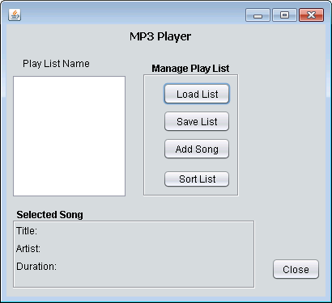

**COMP167 Laboratory 4 -- Classes and ArrayLists**

As with Lab2, you will complete a simple
mock mp3 player in this lab. The first step will be to create two
classes that will enable you to manipulate the song data. I have the
code for the GUI so if you implement the classes according to the
specification, your entire application will work.

**Classes:**

1.  Start off by creating empty Song and Playlist classes.

2.  Add the properties in both classes and stubs for all the required
    methods/behaviors.

3.  Complete the Song class

4.  Complete the PlayList class

5.  Complete Problems 1 -- 6 in the Mp3Controller class. In some cases,
    you will have to uncomment lines of code.

**Song** -- This class will consist of the following properties:
title:String, artist:String and duration:int (**Note:** *duration*
represents the length of the song in seconds). Use data encapsulation
for your class and create these additional methods:

-   A no-arg constructor that simply initializes all string properties
    to null and numeric properties to 0.

-   A constructor that includes a formal parameter for each instance
    variable in the class.

-   A method named *toString()* that has no parameters that returns a
    string containing all the property values separated by a newline
    char ('\\n') - E.g. "Respect\\nAretha Franklin\\n182".

**Playlist --** This class will consists of the following properties:
name:String, songs:ArrayList\<Song\> and creationDate: Calendar. Use
data encapsulation for your class and create these additional methods:

-   A no-arg constructor that instantiates the ArrayList, initializes
    the creationDate to the current date and initializes name to null.

-   readPlayList(inputFile : File):void reads a playlist in from a file
    in the following format:

    -   name

    -   mm/dd/yyyy //creation date

    -   song 0 title

    -   song 0 artist

    -   song 1 duration

    -   ...

> **Note:** there should be a newline character after the last duration
> value.

-   getSong( index:int) : Song -- Returns the song stored at location
    index in the ArrayList.

-   setSong(index:int, song:Song):void -- set the song at location index
    equal to the given Song object. Your code must confirm that the
    given index is in the range of locations currently in the ArrayList.

-   addSong(song:Song) -- adds the given Song object to the end of the
    ArrayList (otherwise return null).

-   removeSong(index:int):Song -- remove the song at location index and
    return it as the method return value. Confirm that the given index
    is in the range of locations currently in the ArrayList (otherwise
    return null).

-   setCreationDate() : void -- sets creation date to be current date
    and time.

-   setCreationDate( month:int, day:int, year:int):void - set creation
    equal to the given date.

-   getCreationDateString():String -- return the creation date as a
    string.

<!-- -->

-   writePlayList(outputFile : File):void -- writes the playlist out in
    the format described in the readPlayList method. You should be able
    to use the PlayList toString() method to implement this operation.

<!-- -->

-   size():int -- returns the number of Songs in the playlist.

-   clearPlayList():void -- clears the playlist of all songs and resets
    the other fields to the same values used in the constructor.

-   toString() -- return a string containing the playlist name,
    creationDate, list of songs. Use '\\n' to separate the playlist
    fields and the songs (Note: your method should call the toString()
    method from Song to append the Song information.

**Grading:**

-   Complete the Song class (5 total points)

-   Have your code to load the songs from the song file into the
    ListView control (18 total points)

-   Save an updated PlayList to a file (25 total points)
